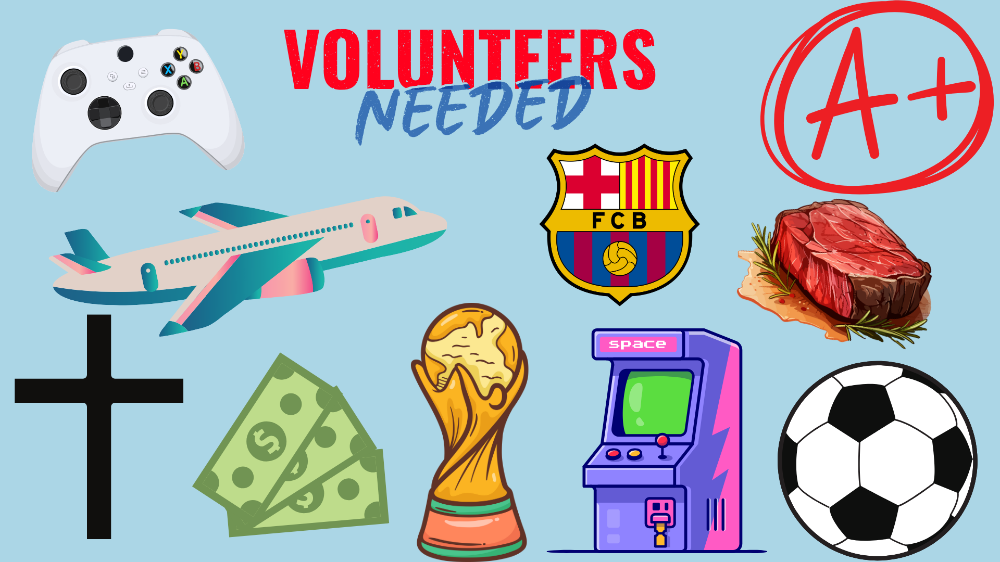

# Me in Markdown 
## Introduction
Hello my name is Daniel I am in 10th grade and I am 15 years old. My favorite food is steak I like it cooked medium well. I also really love fettucine alfredo. I really love soccer and my favorite team is FC BARCELONA and my favorite player is Messi. I currentley play competive club soccer and high school soccer. I know alot about the game of soccer so feel free to ask me anytime about soccer. I really want to go to as many World Cup games as I want to next year. I love to meet soccer players some of the most popular players I have met are Rafaeal Leao, Endrick, Rodrygo, Marquinhos, and Gabriel Martenelli. The most memorable experience I had this summer was going to the PSG soccer players at their hotel. I woke up at 4:30 so I could leave by 5:30 to get their at 7:00. They were staying in Newport Beach so it was about an hour and a half drive. I got there at 7 and waited for them to leave the hotel to go to training to get a few autographs and pictures. I ended up meeting Marquinhos , Kimpembe, and Luis Enrique the coach. I ended up staying there all the way till 3:00 pm so it was a full day. I was really greatful for my mom for taking me this early in the morning it meant a lot for me.  For me I have some goals this year in 10th grade. First I would like to get straight A's. Second I would like to be the captain for my club and high school soccer team. My favorite movie right now is Scarface it is a very intresting movie showing the history of the past and it also shows how horrible the world of drugs are.
## My Playlist

[Me-In-Markdown Playlist](https://open.spotify.com/playlist/3lSDXrrmHyGYhhMyCk6oPy)

## Collage/ Moodboard

